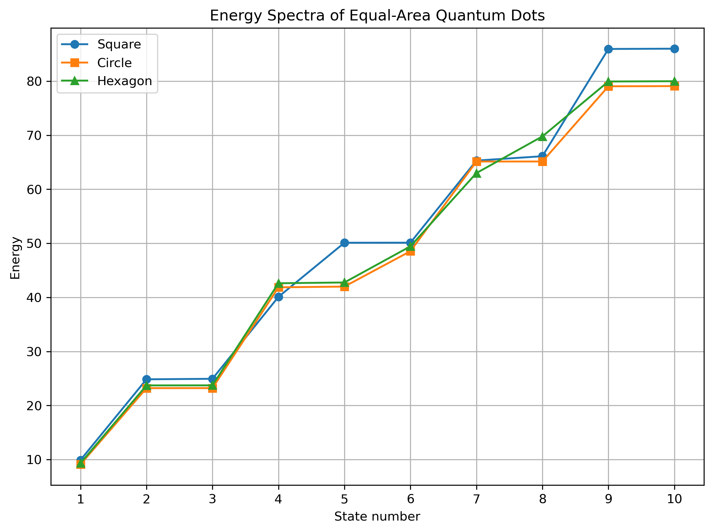
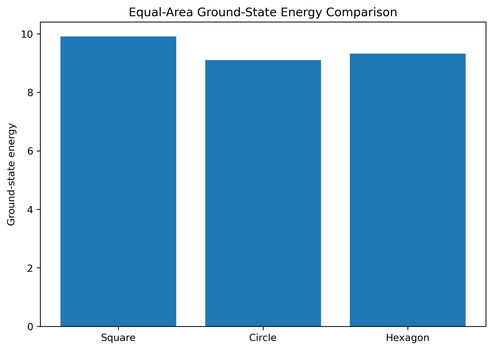

# Finite Element Modeling of Two-Dimensional Quantum Dots

A computational physics project investigating the numerical solution of the two-dimensional time-independent Schrödinger equation using the **Finite Element Method (FEM)**.

**Author:** Renato R. Silva
**Institution:** University of Massachusetts Dartmouth
**Program:** M.S. Physics

---

## Overview

This project develops a finite element solver for particles confined within two-dimensional quantum dots of different geometries. The primary objective is to investigate how the geometry of a quantum dot influences its quantum energy spectrum.

The implementation assembles the global stiffness and mass matrices, applies Dirichlet boundary conditions, solves the resulting generalized eigenvalue problem, and compares the low-energy eigenstates for multiple geometries having equal areas.

Current geometries include:

* Square
* Circle
* Regular Hexagon

---

## Mathematical Model

The time-independent Schrödinger equation is

$$
-\frac{1}{2}\nabla^2\psi = E\psi
$$

After finite-element discretization, the problem becomes the generalized eigenvalue problem

$$
A\psi = EB\psi
$$

where

* **A** is the global stiffness matrix,
* **B** is the global mass matrix,
* **E** contains the energy eigenvalues, and
* **ψ** represents the corresponding eigenfunctions.

---

# Validation

Before comparing different geometries, the implementation was validated using the analytical solution of the two-dimensional infinite square well.

As the mesh is refined, the numerical ground-state energy converges toward the analytical value.

| Mesh Resolution | FEM Ground-State Energy | Percent Error |
| --------------: | ----------------------: | ------------: |
|               5 |               10.861103 |       10.046% |
|              10 |               10.114213 |        2.478% |
|              20 |                9.930552 |        0.618% |
|              30 |                9.896676 |        0.274% |

---

# Results

## Equal-Area Energy Spectra

The figure below compares the first ten energy levels for equal-area square, circular, and hexagonal quantum dots.



---

## Ground-State Comparison

Comparison of the lowest energy state for each geometry.



---

# Repository Structure

```text
Quantum-Dots/
│
├── src/
│   ├── FEM.py
│   ├── square_solver.py
│   ├── circle_mesh.py
│   ├── circle_solver.py
│   ├── hexagon_mesh.py
│   ├── hexagon_solver.py
│   └── compare_geometries.py
│
├── results/
│   ├── data/
│   └── figures/
│
├── archive/
│
├── README.md
├── LICENSE
└── requirements.txt
```

---

# Installation

Clone the repository:

```bash
git clone https://github.com/natodamus/Quantum-Dots.git
cd Quantum-Dots
```

Install the required packages:

```bash
pip install -r requirements.txt
```

Run the geometry comparison:

```bash
python src/compare_geometries.py
```

---

# Future Work

* Adaptive mesh refinement
* Higher-order finite elements
* Additional quantum dot geometries
* Excited-state eigenfunction visualization
* Convergence analysis for multiple geometries
* Time-dependent Schrödinger equation
* Finite potential wells

---

# Acknowledgments

This repository contains the computational work developed as part of my M.S. Physics research at the University of Massachusetts Dartmouth.

The project focuses on applying finite element methods to quantum confinement problems and serves as the foundation for ongoing numerical investigations into two-dimensional quantum systems.
