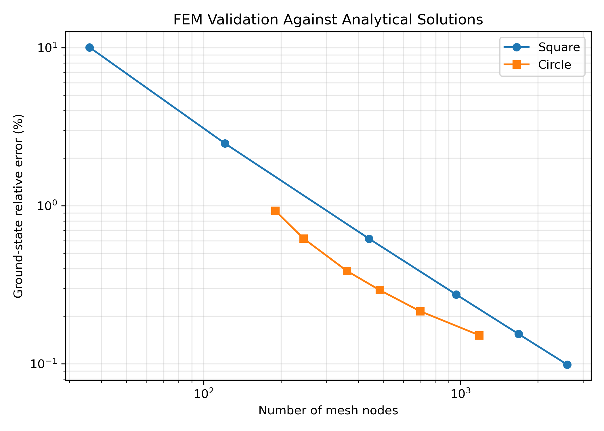
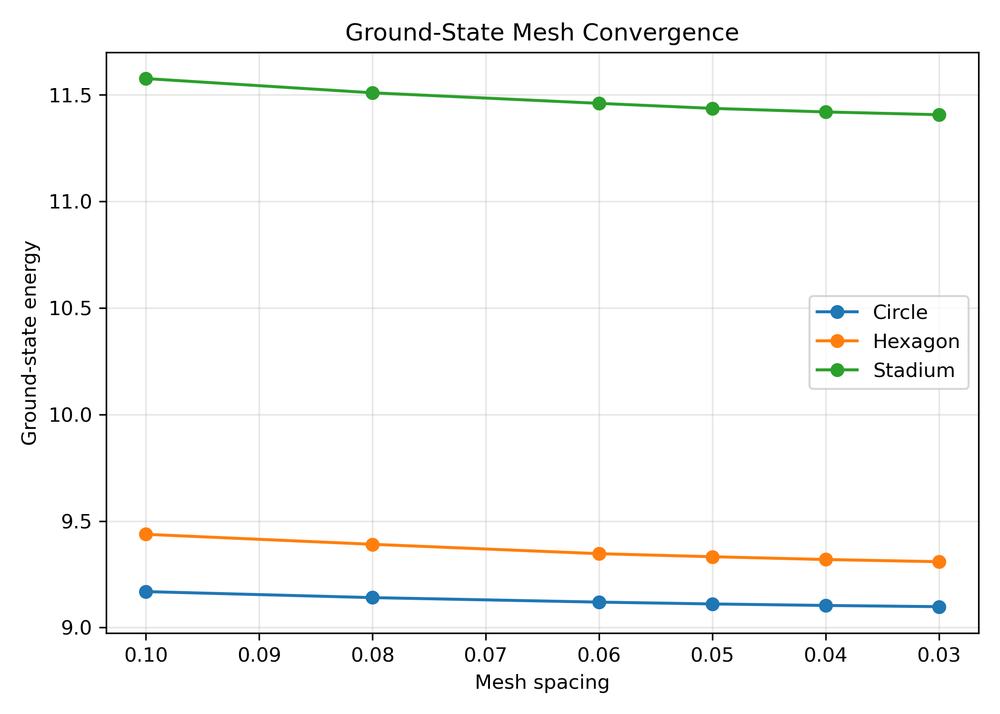
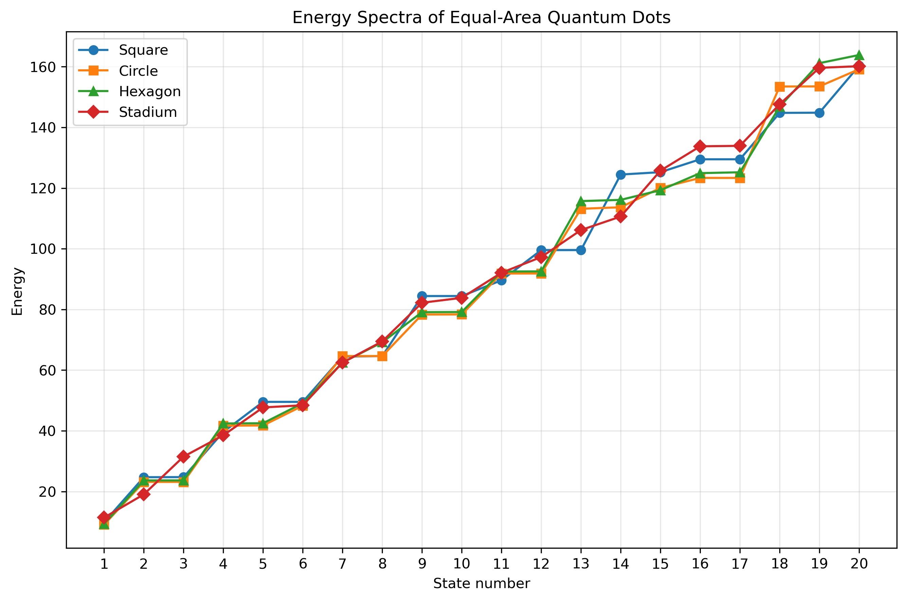
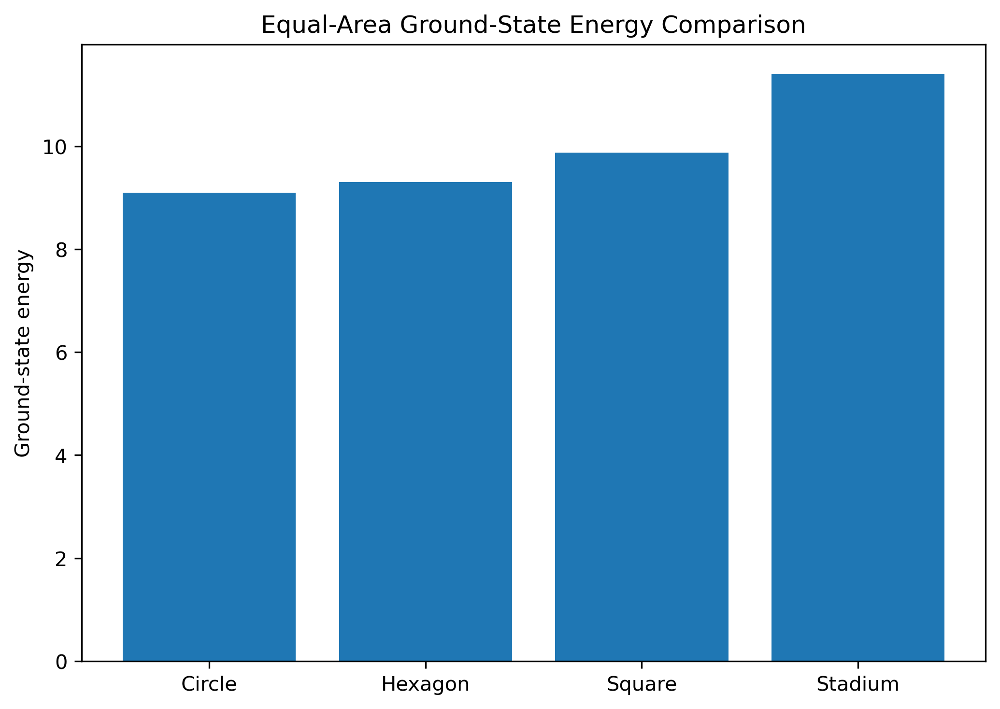
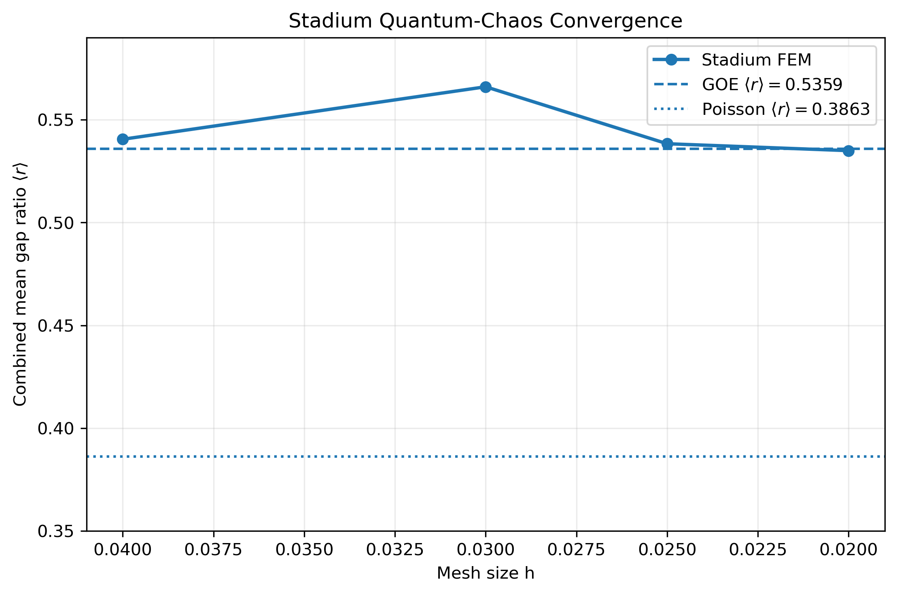

# Finite Element Modeling of Two-Dimensional Quantum Dots

A computational physics project investigating the numerical solution of the two-dimensional time-independent Schrödinger equation using the **Finite Element Method (FEM)**.

**Author:** Renato R. Silva  
**Institution:** University of Massachusetts Dartmouth  
**Program:** M.S. Physics

---

## Overview

This project investigates how the geometry of a two-dimensional quantum dot influences its energy spectrum and eigenfunctions.

The time-independent Schrödinger equation is solved numerically for particles confined by infinite potential boundaries. Linear triangular finite elements are used to discretize the domain, assemble the stiffness and mass matrices, impose Dirichlet boundary conditions, and solve the resulting generalized eigenvalue problem.

Four quantum-dot geometries are considered:

* Square
* Circle
* Regular hexagon
* Stadium

To isolate the effect of geometry, all four domains are scaled to have equal area.

The numerical implementation is validated against analytical solutions for the square and circular infinite wells. Mesh-convergence studies are used to establish suitable numerical resolutions, and an independent basis-expansion method provides an additional comparison for the hexagonal and stadium geometries.

The stadium geometry is also used to explore spectral signatures associated with quantum chaos.

---

## Mathematical Model

In dimensionless units with

$$
\hbar = m = 1,
$$

the time-independent Schrödinger equation inside the quantum dot is

$$
-\frac{1}{2}\nabla^2\psi = E\psi.
$$

For an infinite potential boundary,

$$
\psi = 0
$$

on the boundary of the domain.

Multiplying the Schrödinger equation by a test function $v$ and integrating over the domain gives

$$
-\frac{1}{2}
\int_{\Omega}
v\nabla^2\psi\,d\Omega
=
E
\int_{\Omega}
v\psi\,d\Omega.
$$

Integration by parts gives the weak form

$$
\frac{1}{2}
\int_{\Omega}
\nabla v\cdot\nabla\psi\,d\Omega
=
E
\int_{\Omega}
v\psi\,d\Omega,
$$

where the boundary contribution vanishes because of the Dirichlet boundary condition.

Using linear triangular finite elements,

$$
\psi \approx \sum_j c_j N_j,
$$

which leads to the generalized eigenvalue problem

$$
\frac{1}{2}A\mathbf{c}
=
E B\mathbf{c},
$$

with

$$
A_{ij}
=
\int_{\Omega}
\nabla N_i\cdot\nabla N_j\,d\Omega
$$

and

$$
B_{ij}
=
\int_{\Omega}
N_iN_j\,d\Omega.
$$

Here, $A$ is the global stiffness matrix and $B$ is the global mass matrix.

---

## Equal-Area Geometries

Each geometry is scaled to have area

$$
A=1.
$$

For the square,

$$
L=1.
$$

For the circle,

$$
R=\frac{1}{\sqrt{\pi}}.
$$

For a regular hexagon,

$$
R=
\sqrt{\frac{2}{3\sqrt{3}}},
$$

where $R$ is the distance from the center to a vertex.

The stadium consists of a central rectangle and two semicircular endcaps. Taking the rectangle half-length $a$ equal to the semicircle radius $R$ gives

$$
4aR+\pi R^2=1,
$$

and therefore

$$
a=R=\frac{1}{\sqrt{4+\pi}}.
$$

This normalization allows differences in the calculated spectra to be attributed primarily to geometry rather than domain area.

---

## Numerical Validation

### Square Infinite Well

For a square of side length $L=1$, the analytical energy levels are

$$
E_{n_x,n_y}
=
\frac{\pi^2}{2}
\left(
n_x^2+n_y^2
\right).
$$

The analytical ground-state energy is

$$
E_1=\pi^2\approx9.869604.
$$

The FEM solution converges toward this value as the mesh is refined.

At the final resolution used for the geometry comparison,

$$
E_1^{\mathrm{FEM}}=9.879347,
$$

corresponding to an error of approximately

$$
0.099\%.
$$

### Circular Infinite Well

The circular well provides a second analytical validation using the zeros of Bessel functions.

For the equal-area circle, the analytical ground-state energy is

$$
E_1^{\mathrm{exact}}=9.084207.
$$

The final FEM calculation gives

$$
E_1^{\mathrm{FEM}}=9.097966,
$$

with an error of approximately

$$
0.151\%.
$$

These comparisons provide independent validation of the FEM implementation for both polygonal and curved boundaries.

---

## Mesh Convergence

Mesh-refinement studies were performed for all four geometries.

The final numerical resolutions used for the primary comparison were:

| Geometry | Resolution |
| --- | --- |
| Square | $N=50$ |
| Circle | $h=0.03$ |
| Hexagon | $h=0.03$ |
| Stadium | $h=0.03$ |

The circle used 100 explicitly generated boundary nodes, while the stadium used 60 points on each semicircular arc.

The final meshes were:

| Geometry | Nodes | Elements | Mesh Area |
| --- | ---: | ---: | ---: |
| Square | 2601 | 5000 | 1.000000 |
| Circle | 1182 | 2262 | 0.999342 |
| Hexagon | 1213 | 2298 | 1.000000 |
| Stadium | 1275 | 2357 | 0.999792 |

The convergence study confirms that the low-energy FEM solutions become increasingly stable as the meshes are refined.





---

## Equal-Area Energy Spectra

The first 20 energy eigenvalues were calculated for each equal-area geometry.

The ground-state energies are

| Geometry | Ground-State Energy |
| --- | ---: |
| Circle | 9.097966 |
| Hexagon | 9.309033 |
| Square | 9.879347 |
| Stadium | 11.406774 |

The circle has the lowest ground-state energy of the four geometries. This is consistent with the Faber-Krahn theorem, which states that among domains of equal area, the disk minimizes the first Dirichlet eigenvalue of the Laplacian.

The ordering of the excited states is more complicated and depends on the geometry and its symmetries.





---

## Eigenfunctions and Symmetry

The FEM eigenvectors are used to reconstruct the spatial eigenfunctions and probability densities for each geometry.

The calculated states display the symmetry properties expected from their respective boundaries.

The square exhibits degeneracies associated with exchanging the quantum numbers $n_x$ and $n_y$. The circle contains nearly degenerate pairs associated with rotational symmetry, while the regular hexagon exhibits patterns associated with its discrete sixfold symmetry.

The stadium retains reflection symmetry about both coordinate axes but generally displays fewer degeneracies than the more symmetric geometries.

For degenerate or nearly degenerate states, the numerical eigensolver may return different linear combinations of states within the same eigenspace. The orientation of an individual numerical eigenfunction is therefore not unique even though the physical eigenspace is unchanged.

---

## Independent Basis-Expansion Comparison

An independent basis-expansion calculation was implemented as an additional numerical comparison.

The wavefunction is expanded in a rectangular sine basis,

$$
\phi_{mn}(x,y)
=
\frac{2}{\sqrt{L_xL_y}}
\sin\left(
\frac{m\pi(x-x_{\min})}{L_x}
\right)
\sin\left(
\frac{n\pi(y-y_{\min})}{L_y}
\right).
$$

The desired geometry is represented inside the rectangular basis domain using a finite potential barrier $V_0$ outside the quantum dot.

The resulting Hamiltonian is diagonalized and compared with the FEM spectrum for the hexagonal and stadium geometries.

Because the basis calculation uses a finite barrier and a truncated basis, it is not an exact representation of the infinite-wall FEM problem. Instead, it provides an independent numerical cross-check.

Convergence studies were performed with respect to both basis size and barrier height. Increasing the basis size improves the representation of the confined states, while very large barriers require increasingly large bases to resolve the sharp boundary accurately.

---

## Stadium and Quantum Chaos

The stadium billiard provides an additional application of the FEM solver.

Unlike the classically integrable square and circular billiards, the classical Bunimovich stadium exhibits chaotic dynamics. In the corresponding quantum problem, signatures of this behavior can be investigated through statistical properties of the energy spectrum.

### Adjacent-Gap Ratio

For consecutive energy spacings

$$
s_n=E_{n+1}-E_n,
$$

the adjacent-gap ratio is defined as

$$
r_n
=
\frac{
\min(s_n,s_{n+1})
}{
\max(s_n,s_{n+1})
}.
$$

This statistic is useful because it does not require spectral unfolding.

For an integrable system with Poisson level statistics,

$$
\langle r\rangle_{\mathrm{Poisson}}
\approx0.3863.
$$

For a time-reversal-symmetric chaotic system described by Gaussian Orthogonal Ensemble statistics,

$$
\langle r\rangle_{\mathrm{GOE}}
\approx0.5359.
$$

### Reflection Symmetry Sectors

The stadium has reflection symmetry about both the $x$ and $y$ axes. Mixing states from different symmetry classes can obscure level repulsion, so the spectrum is separated into four parity sectors:

$$
(+,+),\quad (+,-),\quad (-,+),\quad (-,-).
$$

A quarter-stadium FEM model is used to impose these symmetries directly.

Even parity corresponds to a Neumann condition on the appropriate symmetry axis,

$$
\frac{\partial\psi}{\partial n}=0,
$$

while odd parity corresponds to a Dirichlet condition,

$$
\psi=0.
$$

The physical stadium boundary remains Dirichlet in every sector.

The quarter-domain calculations reproduce the corresponding low-energy states of the full stadium calculation, providing a numerical check of the symmetry reduction.

### Spectral Statistics

Using the first 50 states from each symmetry sector, the adjacent-gap ratios were calculated separately and then combined.

At the finest mesh investigated,

$$
h=0.020,
$$

the combined mean adjacent-gap ratio was

$$
\langle r\rangle=0.5350.
$$

This is close to the GOE reference value

$$
\langle r\rangle_{\mathrm{GOE}}=0.5359
$$

and well separated from the Poisson reference value.



The result is consistent with the level repulsion expected for the quantum-chaotic stadium billiard. Higher-energy eigenvalues converge more slowly with mesh refinement, so this analysis is treated as an exploratory numerical investigation rather than a complete statistical characterization of quantum chaos.

---

## Repository Structure

```text
Quantum-Dots/
│
├── src/
│   ├── FEM.py
│   │
│   ├── square_solver.py
│   ├── circle_mesh.py
│   ├── circle_solver.py
│   ├── hexagon_mesh.py
│   ├── hexagon_solver.py
│   ├── stadium_mesh.py
│   ├── stadium_solver.py
│   │
│   ├── convergence_study.py
│   ├── compare_geometries.py
│   ├── plot_eigenfunctions.py
│   │
│   ├── box_basis.py
│   ├── hexagon_basis.py
│   ├── stadium_basis.py
│   ├── basis_convergence.py
│   ├── compare_methods.py
│   │
│   ├── spectral_statistics.py
│   ├── stadium_symmetry.py
│   ├── stadium_sector_solver.py
│   ├── stadium_chaos.py
│   └── chaos_convergence.py
│
├── results/
│   ├── data/
│   └── figures/
│
├── archive/
│
├── README.md
├── LICENSE
└── requirements.txt
```

---

## Installation

Clone the repository:

```bash
git clone https://github.com/natodamus/Quantum-Dots.git
cd Quantum-Dots
```

Install the required packages:

```bash
pip install -r requirements.txt
```

Run the primary equal-area geometry comparison:

```bash
python src/compare_geometries.py
```

Run the FEM convergence study:

```bash
python src/convergence_study.py
```

Run the eigenfunction visualization:

```bash
python src/plot_eigenfunctions.py
```

Run the independent numerical comparison:

```bash
python src/compare_methods.py
```

Run the stadium quantum-chaos convergence study:

```bash
python src/chaos_convergence.py
```

---

## Conclusions

The finite element method provides an accurate and flexible approach for solving the two-dimensional Schrödinger equation in quantum dots with different boundary geometries.

The square and circular calculations reproduce known analytical solutions with small numerical error, while mesh-refinement studies demonstrate convergence of the FEM solutions.

For equal-area domains, the geometry significantly affects both the ground-state energy and the excited-state spectrum. The circular domain produces the lowest ground-state energy, while changes in symmetry produce distinct degeneracy patterns and eigenfunction structures.

The independent basis-expansion calculations provide an additional numerical comparison for geometries without simple analytical solutions.

Finally, symmetry-resolved spectral statistics for the stadium produce an adjacent-gap ratio consistent with the level repulsion expected for a quantum-chaotic billiard, demonstrating how the same FEM framework can be extended from quantum confinement calculations to the study of spectral signatures of quantum chaos.

---

## Future Work

Possible extensions include:

* Higher-order finite elements
* Adaptive mesh refinement
* Sparse eigensolvers for larger meshes
* More extensive high-energy spectral statistics
* Additional quantum-dot and quantum-billiard geometries
* Finite potential wells
* Time-dependent Schrödinger equation

---

## Acknowledgments

This repository contains the computational work developed as part of my M.S. Physics research at the University of Massachusetts Dartmouth.

The project focuses on finite element methods, quantum confinement, geometry-dependent energy spectra, and numerical exploration of two-dimensional quantum billiards.