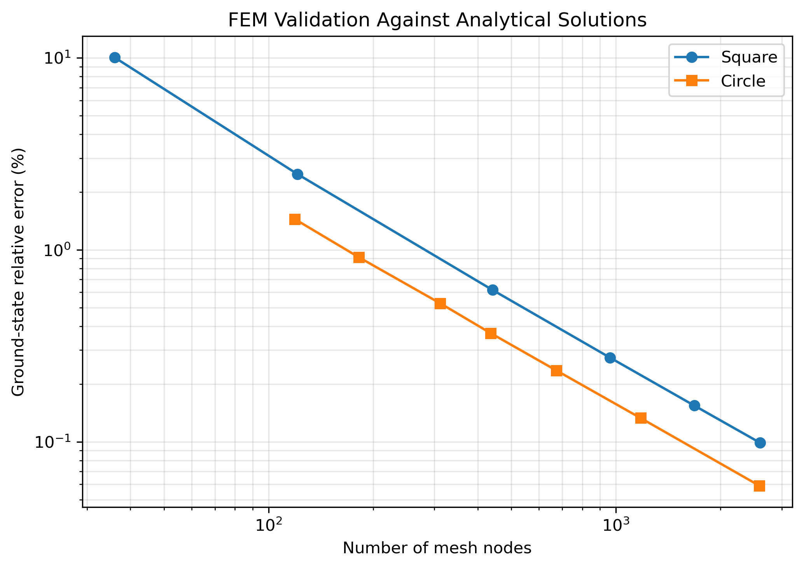
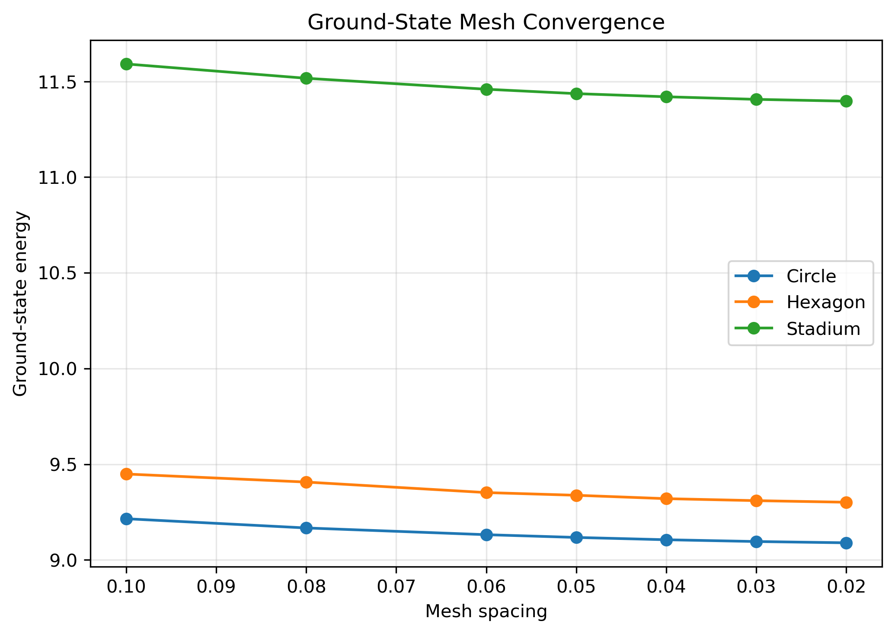
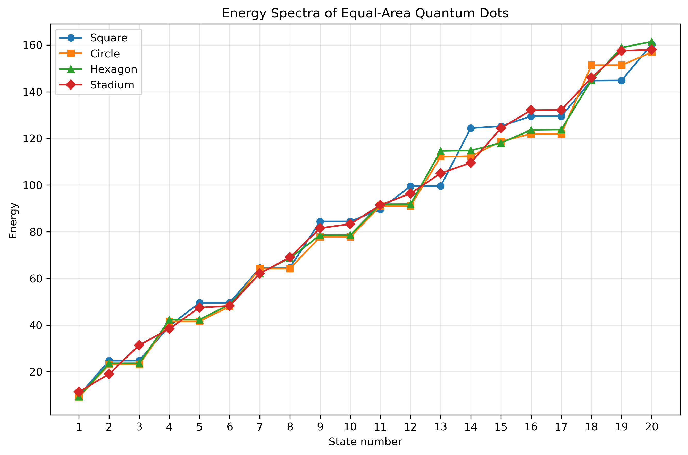
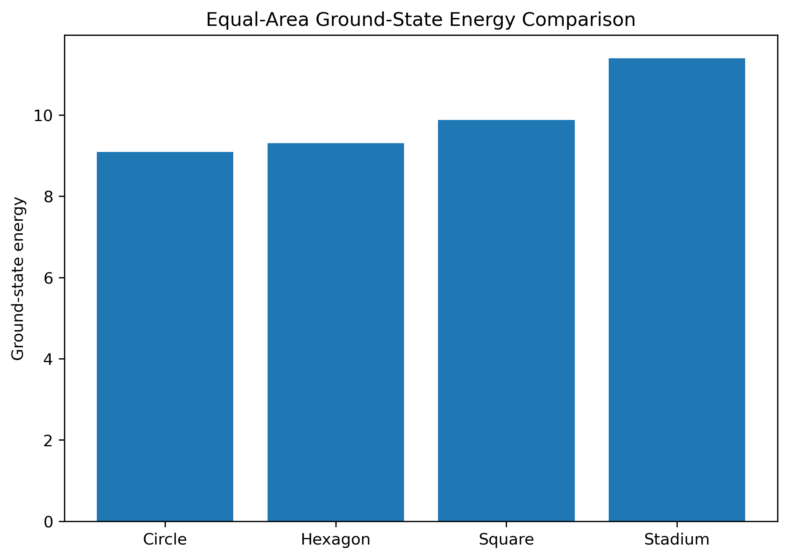
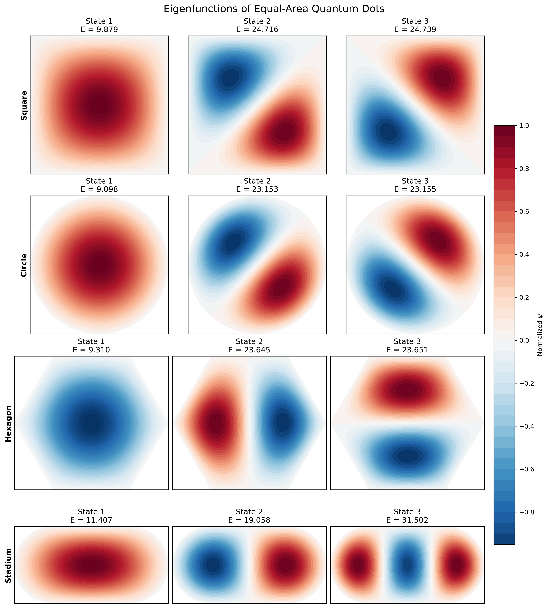
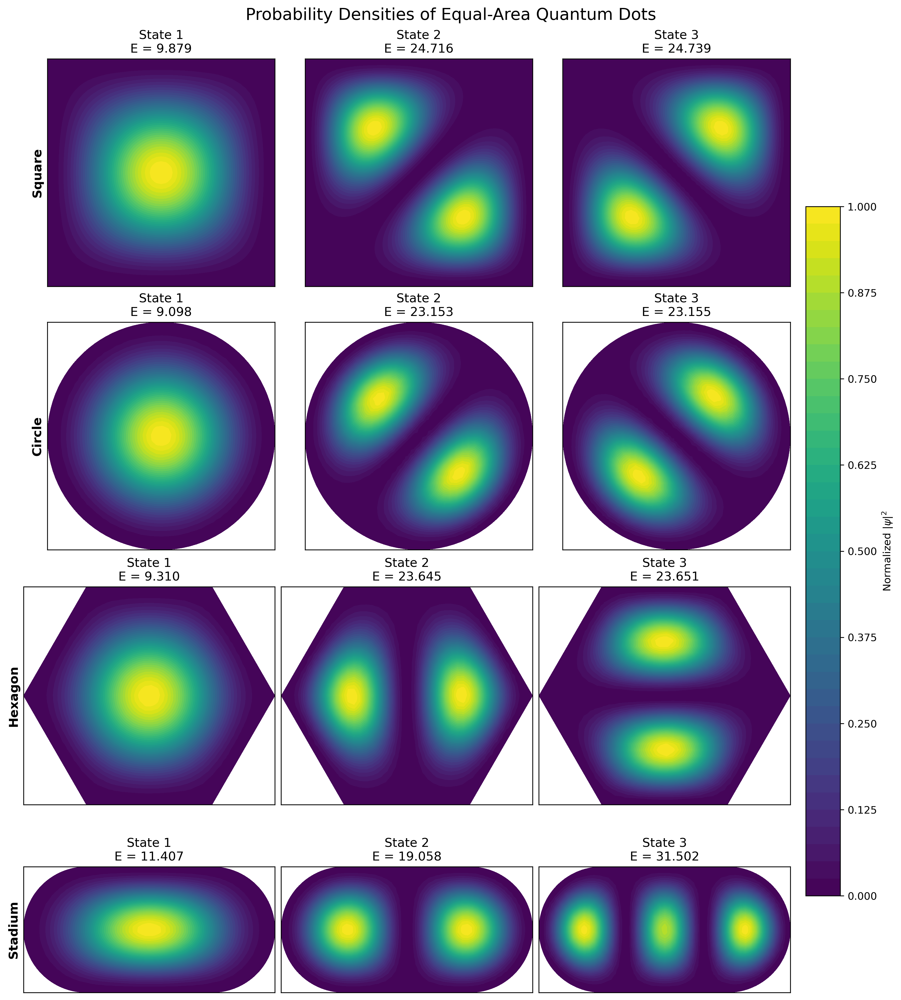
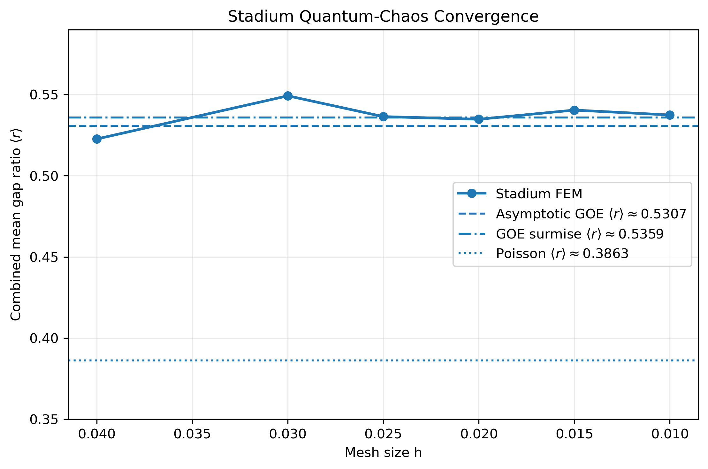

# Finite Element Modeling of Two-Dimensional Quantum Dots

A computational physics project investigating the numerical solution of the two-dimensional time-independent Schrödinger equation using the **Finite Element Method (FEM)**.

**Author:** Renato R. Silva  
**Institution:** University of Massachusetts Dartmouth  
**Program:** M.S. Physics

---

## Overview

This project investigates how the geometry of a two-dimensional quantum dot influences its energy spectrum and eigenfunctions.

The time-independent Schrödinger equation is solved numerically for particles confined by infinite potential boundaries. Four geometries are considered:

- Square
- Circle
- Regular hexagon
- Stadium

All four domains are scaled to have equal area so that differences in their spectra can be attributed primarily to geometry.

The FEM implementation is validated against analytical solutions for the square and circular infinite wells. Additional numerical studies include mesh convergence, an independent basis-expansion comparison, eigenfunction visualization, and symmetry-resolved spectral statistics for the stadium billiard.

---

## Physical Model

In dimensionless units with $\hbar=m=1$, the time-independent Schrödinger equation is

$$
-\frac{1}{2}\nabla^2\psi=E\psi,
$$

with the infinite-wall boundary condition

$$
\psi=0.
$$

Using linear triangular finite elements, the problem is reduced to the generalized eigenvalue equation

$$
\frac{1}{2}A\mathbf{c}=EB\mathbf{c},
$$

where $A$ and $B$ are the FEM stiffness and mass matrices.

---

## Equal-Area Geometries

Each geometry has area

$$
A=1.
$$

The corresponding parameters are

$$
L_{\mathrm{square}}=1,
$$

$$
R_{\mathrm{circle}}=\frac{1}{\sqrt{\pi}},
$$

$$
R_{\mathrm{hexagon}} = \sqrt{\frac{2}{3\sqrt{3}}}
$$

and for the stadium,

$$
a=R=\frac{1}{\sqrt{4+\pi}}.
$$

The final FEM resolutions used for the primary geometry comparison are:

| Geometry | Resolution |
| --- | --- |
| Square | $N=50$ |
| Circle | $h=0.02$ |
| Hexagon | $h=0.02$ |
| Stadium | $h=0.02$ |

---

## Validation

The square and circle provide analytical benchmarks for validating the FEM implementation.

| Geometry | Exact $E_1$ | FEM $E_1$ | Error |
| --- | ---: | ---: | ---: |
| Square | 9.869604 | 9.879347 | 0.099% |
| Circle | 9.084207 | 9.089569 | 0.059% |

Mesh-refinement studies show convergence toward the analytical results and increasing stability of the numerical solutions.





---

## Equal-Area Spectrum

The final ground-state energies are:

| Geometry | $E_1$ |
| --- | ---: |
| Circle | 9.089569 |
| Hexagon | 9.301499 |
| Square | 9.879347 |
| Stadium | 11.396646 |

The circle produces the lowest ground-state energy, consistent with the Faber-Krahn theorem for equal-area domains.

The excited-state spectra also display geometry-dependent degeneracy and symmetry structures.





---

## Eigenfunctions

FEM eigenvectors are reconstructed on the full meshes to visualize the spatial wavefunctions and probability densities.

The resulting states show the characteristic symmetry structures of the square, circle, hexagon, and stadium geometries.





---

## Independent Basis Comparison

An independent rectangular sine-basis method is used as a numerical cross-check for the hexagon and stadium.

The geometry is represented using a finite external potential barrier and the Hamiltonian is diagonalized in a truncated sine basis.

Because this method uses both a finite barrier and a finite basis, it is not an exact representation of the infinite-wall FEM problem. It is therefore used as an independent comparison rather than an exact benchmark.

Basis-size and barrier-height studies are included in `basis_convergence.py`.

---

## Stadium Quantum Chaos

The stadium billiard is also used to investigate spectral signatures of quantum chaos.

Because the stadium has reflection symmetry about both coordinate axes, the spectrum is separated into four parity sectors:

$$
(+,+),\quad(+,-),\quad(-,+),\quad(-,-).
$$

Adjacent-gap ratios are calculated independently within each symmetry sector before being combined.

At the finest investigated mesh spacing,

$$
h=0.01,
$$

the calculation gives

$$
\langle r\rangle=0.5374.
$$

For comparison,

$$
\langle r\rangle_{\mathrm{Poisson}}\approx0.3863,
$$

while GOE statistics give a mean adjacent-gap ratio near $0.53$.

The calculated stadium statistic is therefore consistent with the GOE-like level repulsion expected for a quantum-chaotic billiard.

Mesh and level-count studies are included to test the robustness of this result.



---

## Repository Structure

```text
Quantum-Dots/
│
├── src/
│   ├── FEM.py
│   │
│   ├── square_solver.py
│   ├── circle_mesh.py
│   ├── circle_solver.py
│   ├── hexagon_mesh.py
│   ├── hexagon_solver.py
│   ├── stadium_mesh.py
│   ├── stadium_solver.py
│   │
│   ├── convergence_study.py
│   ├── compare_geometries.py
│   ├── plot_eigenfunctions.py
│   │
│   ├── box_basis.py
│   ├── circle_analytical.py
│   ├── hexagon_basis.py
│   ├── stadium_basis.py
│   ├── basis_convergence.py
│   ├── compare_methods.py
│   │
│   ├── stadium_sector_solver.py
│   ├── stadium_chaos.py
│   └── chaos_convergence.py
│
├── results/
│   ├── data/
│   └── figures/
│
├── README.md
├── LICENSE
└── requirements.txt
```

---

## Running the Project

Install the required packages:

```bash
pip install -r requirements.txt
```

Run the main equal-area comparison:

```bash
python src/compare_geometries.py
```

Run the FEM convergence study:

```bash
python src/convergence_study.py
```

Generate the eigenfunction figures:

```bash
python src/plot_eigenfunctions.py
```

Run the independent FEM/basis comparison:

```bash
python src/compare_methods.py
```

Run the basis convergence study:

```bash
python src/basis_convergence.py
```

Run the stadium quantum-chaos analysis:

```bash
python src/stadium_chaos.py
```

Test the convergence of the chaos statistic:

```bash
python src/chaos_convergence.py
```

---

## Summary

The project demonstrates that FEM provides an accurate and flexible method for solving the two-dimensional Schrödinger equation across different confinement geometries.

The square and circle reproduce known analytical spectra with small numerical error, while the equal-area comparison demonstrates the influence of boundary geometry on quantum energy levels and eigenfunctions.

The same FEM framework is extended to the stadium billiard, where symmetry-resolved spectral statistics produce an adjacent-gap ratio consistent with GOE-like level repulsion and the expected signatures of quantum chaos.

---

## Acknowledgments

This repository contains the computational work developed as part of my M.S. Physics research at the University of Massachusetts Dartmouth.